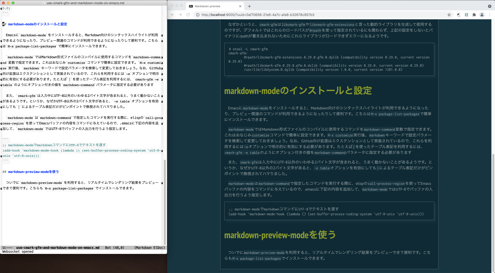

　最近Markdownで文章を書くことが増えているので色々と環境を整えたのですが、GitHubが独自に拡張した文法をサポートするMarkdownコンパイラの[cmark-gfm](https://github.com/github/cmark-gfm)とEmacsの`markdown-mode`を組み合わせようとしたら色々とハマったので対処方法をメモしておきます。

## macOS環境でのcmark-gfmのビルドとインストール

　cmark-gfmのリポジトリではバイナリは提供されていないので、自前でビルドする必要があります。macOS環境（Xcode）でのビルドには[CMake](https://cmake.org/)が必要となるので、まずこちらの準備を行います。CMakeは公式にmacOS向けのバイナリが提供されているので、dmgファイルもしくはtar.gzファイルをダウンロードしてその中身を`/Applications`ディレクトリにコピーすればOKです。`cmake`コマンド自体はアプリケーションバンドル中の`Contents/bin`ディレクトリ内に入っているので、適当にパスを通すなり直接フルパスで実行するなりします。

　`cmark-gfm`のビルドは次のような感じで実行します。

```
$ git clone https://github.com/github/cmark-gfm
$ cd cmark-gfm
$ mkdir build
$ cd build
$ cmake .. -DCMAKE_INSTALL_PREFIX=~/local -DCMAKE_INSTALL_RPATH=$HOME/local/lib
$ make test
$ make install
```

　システムツール以外はできるだけ`~/local`以下にインストールしたい勢なので、`cmake`実行時に`-DCMAKE_INSTALL_PREFIX=~/local`を指定してインストール先をデフォルトの`/usr/local/`以下から変更しています。ただしこの場合、rpathの自動設定はしてくれないようなので、追加で`-DCMAKE_INSTALL_RPATH=$HOME/local/lib`オプションでrpathを指定します。このオプションでは指定したパスを直接rpathとしてバイナリに書き込むので、`~/`表記は利用できないようです。このオプションを指定しないと、インストール後に次のようなエラーが出ます

```
$ cmark-gfm 
dyld: Library not loaded: @rpath/libcmark-gfm-extensions.0.29.0.gfm.0.dylib
  Referenced from: /Users/hylom/local/bin/cmark-gfm
  Reason: image not found
Abort trap: 6
```

　なぜかというと、`cmark-gfm`は`libcmark-gfm`や`libcmark-gfm-extensions`と言った動的ライブラリを生成して使用するのですが、デフォルトではこれらのロードパスが`@rpath`を使って指定されている一方、上記の設定をしないとバイナリにrpathが書き込まれず、その結果これらライブラリのロードに失敗するためです。

```
$ otool -L cmark-gfm 
cmark-gfm:
	@rpath/libcmark-gfm-extensions.0.29.0.gfm.0.dylib (compatibility version 0.29.0, current version 0.29.0)
	@rpath/libcmark-gfm.0.29.0.gfm.0.dylib (compatibility version 0.29.0, current version 0.29.0)
	/usr/lib/libSystem.B.dylib (compatibility version 1.0.0, current version 1281.0.0)
```

## markdown-modeのインストールと設定

　Emacsに`markdown-mode`をインストールすると、Markdown向けのシンタックスハイライトが利用できるようになったり、プレビュー関連のコマンドが利用できるようになったりして便利です。こちらは`M-x package-list-packages`で簡単にインストールできます。

　`markdown-mode`ではMarkdown形式ファイルのコンパイルに使用するコマンドを`markdown-command`変数で指定できます。これはおなじみ`customize`コマンドで簡単に設定できます。`M-x customize`実行後、`markdown`キーワードで設定パラメータを検索して変更しておきましょう。なお、GitHub向け拡張はエクステンションとして実装されているので、これらを利用するには`-e`オプションで明示的に有効にする必要があります。たとえば`|`を使ったテーブル表記を利用するには、`cmark-gfm -e table`のようにオプション付きの値を`markdown-command`パラメータに指定する必要があります

　また、`cmark-gfm`はUTF-8以外の文字コードに対応していないようです。なぜかUTF-8以外でエンコードされた日本語の場合、`-e table`オプションを有効にしても`|`によるテーブル表記だけがピンポイントで無視されてハマりました。

　`markdown-mode`は`markdown-command`で指定したコマンドを実行する際に、elispの`call-process-region`を使ってEmacsバッファの内容をコマンドに与えているので、.emacsに下記の内容を追加して、`markdown-mode`ではUTF-8でバッファの入出力を行うよう指定します。

```
;; markdown-modeでmarkdownコマンドにUTF-8でテキストを渡す
(add-hook 'markdown-mode-hook (lambda () (set-buffer-process-coding-system 'utf-8-unix 'utf-8-unix)))
```

## markdown-preview-modeを使う



　ついでに`markdown-preview-mode`を利用すると、こんな感じでリアルタイムでレンダリング結果をプレビューできてとても便利です。こちらも`M-x package-list-packages`でインストールできます。


