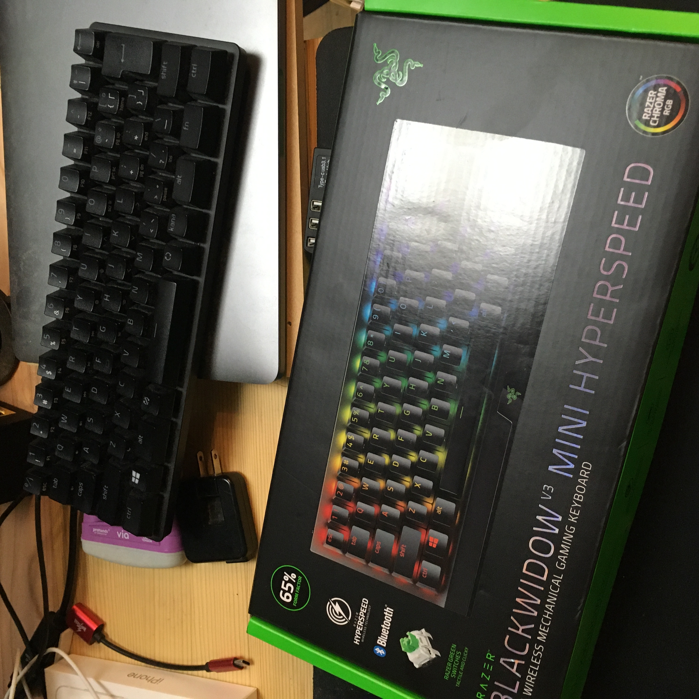
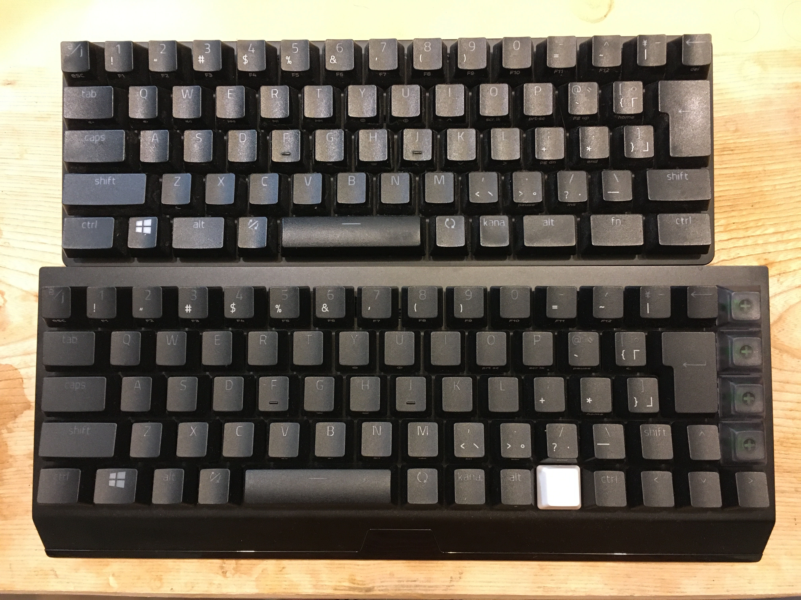
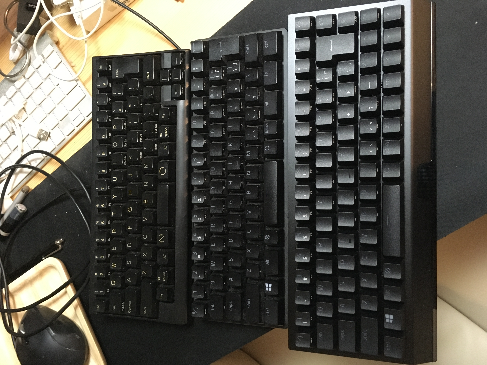
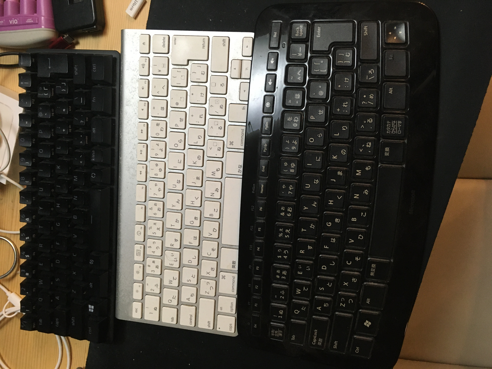

　以前から目をつけていたRazerのワイヤレステンキーレスキーボード「BlackWidow V3 Mini HyperSpeed」の[グリーンスイッチ・日本語配列モデル](https://kakaku.com/item/K0001357648/)だけがなぜか安く販売されていたので買ってみました。数週間使ってみたので簡単なレビューです。

　ちなみに私のキーボード環境ですが、昨年Razerのテンキーレスキーボード「Huntsman Mini」を導入し（[昨年のブログ記事](/2021/05/05/use-razer-huntsman-mini-on-macos)）、仕事用キーボードとしてはこのHuntsman Mini、私的作業用キーボードとしてはApple純正のMagic Keyboardという体制でした。Magic Keyboardのキー配置は自分的に理想的な配置であり、キータッチもそこまで悪くはないため今まで特に変える理由はなかったのですが、最近私的作業用メインマシンをiMacからWindowsのデスクトップPCに切り替えた関係でキーボードを探していたタイミングでこの値下げを見つけてしまい、渡りに船と買ってしまったという流れです。

　ちなみにMagic KeyboardはWindowsでもBluetoothキーボードとして利用できるのですが、一部のキーボードを有効に利用するためには別途Windowsにツール等をインストールして設定する必要があるのと、このキーボードはiMacの付属品でiMacを処分（売却）する際に一緒に手放す必要があるため、せっかくなので別のキーボードを買おうかなと思っていた状況でした。

## コンパクトではあるもののキー配列や筐体などで気になるポイントあり

　このBlackWidow V3 Mini HyperSpeedですが、特徴としてはテンキーレスのコンパクトサイズながら矢印キーやdelete/page up/page down/insertキーを備えている点と、無線接続が可能な点が挙げられます。コンパクトキーボードには矢印キーは不要という向きもあるのですが、個人的にはあると非常に便利だと思っています。特にmacOS環境ではデフォルトでEmacs風ショートカットキーのCtrl＋f/b/p/nでカーソル移動は可能ですが、ChromeやElectronベースのアプリではこのショートカットキーが使えないことがあり、矢印キーが必須になるシーンがあります。しかし、前述のRazer Hantsman Miniでは独自の修飾キー（「fn」キー）と別のj/k/l/iキー同時押しで矢印キー入力となるのですが、これが使いにくい！　fnキーが微妙に押しにくい場所にあるうえに、私の脳にはj/k/l/iキーを矢印キーとして使う文化はインストールされていないため、どうしても操作時にワンテンポ考える時間が発生してしまいます（せめてh/j/k/lのvi風ならまだ良かったのですが）。BlackWidow V3 Mini HyperSpeedは矢印キー搭載ということで、この問題が完全に解決されています。

　一方で、これらのキーを追加したうえでコンパクトな筐体にするため、一部のキー配列が圧縮されているのは残念なところです。具体的には、キーボードの左Ctrlキーおよび左Altキー、左Shiftキーの幅が若干小さくなっており、その分その段のほかのキーが左側に寄っています。個人的にはそこまで気になるレベルではないのですが、神経質な人は気になるかもしれません。また、左AltキーがWindowsキーよりも小さくなっているのですが、個人的にはWindowsキーよりもAltキーのほうが多用するため、幅を小さくするならWindowsキーのほうを小さくして欲しかったところです。

　ちなみに、このキー配列問題は日本語配列バージョンのみの問題のようで、[RazerのWebサイトに掲載されている製品写真](https://www2.razer.com/jp-jp/gaming-keyboards-keypads/razer-blackwidow-v3-mini-hyperspeed)を見る限り、英語配列バージョンでは右Shiftキー、右altキー、右Ctrlキーが短くなりアプリケーションキーが削除されている以外はキー配列の差異はないように見えます。

　BackspaceキーやEnterキーの右側にキーがあるのも最初は戸惑いました。特にBackspaceキーは
ホームポジションから手を動かさないと押せないキーなので、Deleteキーとの押し間違いが発生しやすくなっています。5mmほどでよいので、この列には隙間があれば良かったのではと思います。

## ワイヤレスは便利、代償として大きく重くなった？

　もう1つの特徴であるワイヤレス接続ですが、地味に便利です。自分の場合作業スペースを作るためにキーボードを動かしたりすることがよくあるのですが、その際にケーブルを意識しなくて良いのが素晴らしいです。ただ、通常の使用時に気になることはないのですが、バッテリー内蔵のためかキーボード本体の質量はサイズの割に重めに感じられます。

　ワイヤレス接続はBluetooth接続だけでなく、付属する専用USBドングルによる接続の2種類が選択可能ですが、Bluetooth接続の場合はスリープ時にキーボード操作での復帰ができなかったり、キーボード側がスリープした際にそこからの復帰に若干タイムラグが発生するため、一般的なデスクトップPCで使用するのであればUSBドングルの利用がおすすめです。

　バッテリ駆動時間に関しては、現状まったく不満がないレベルです。LEDをオフにしての利用ですが、数週間は充電なしで動作する感じです。

　一方、BlackWidowシリーズの共通のデザインを踏襲しているためと思われますが、筐体下側に若干無駄な出っ張りがあるのが個人的には残念に思われました。この部分は斜めに切り落とされているデザインになっているため、片手で筐体上下を握るように持つ際に持ちにくさがあります。

## Razerおなじみの高いカスタマイズ性はやはり便利

　BlackWidow V3 Mini HyperSpeedはHuntsman Miniと同様、「Razer Central」という設定ツールを使ってキー配置やLEDの点灯パターンを柔軟に設定可能です。Aキーの左側にCtrlキーを配置するのも簡単な操作で設定可能です。デフォルトではキーボード最上段にある1キー左側のキーは半角/全角（e/j）キーになっていますが、これをEscキーにするのも簡単です。

　また、キースイッチはメカニカルキーボードや自作キーボード界隈でおなじみのCherryスイッチ互換になっているため、キーキャップをCherryスイッチ互換のものに差し替えることが可能です。自分は誤操作を防ぐために右側のDelete/Page up/Page down/Insertキーのキャップを背の低いものに差し替え、またfnキーも分かりやすくするために白い汎用キーキャップに差し替えています。

## 数少ない「コンパクトかつワイヤレス接続対応」キーボードの有力な選択肢

　このように若干の不満点はありますが、そもそもコンパクトかつワイヤレスなキーボードは選択肢が少なく、そのなかでこのBlackWidow V3 Mini HyperSpeedはかなり有力な選択肢の1つと言えます。コンパクトさや軽量さではHuntsman Miniに軍配が上がりますが、ワイヤレスであることを重視したり、矢印キーがどうしても必要で、前述したキー配置が許容できるのであればBlackWidow V3 Mini HyperSpeedはおすすめできるキーボードだと思います。

## 蛇足：理想のワイヤレスコンパクトキーボード探しの道のりはまだまだ続く

　「これがHHKB Lite 2」「Razer Huntsman Mini」「Razer BlackWidow V3 Mini HyperSpeed」「全部同じじゃないですか！」という感じでこち亀コラ画像を作れそうな勢いですが、同じに見えないコンパクトキーボードも持っていたりします。Appleのやつとか、MSのやつとか。

　とはいえどれも100％満足しているわけではなく、まだまだ新製品が出たら買ってしまう可能性があります。自作すれば良いという話もありますが、ワイヤレスはバッテリーの関係で自作が面倒くさいのですよね……。

