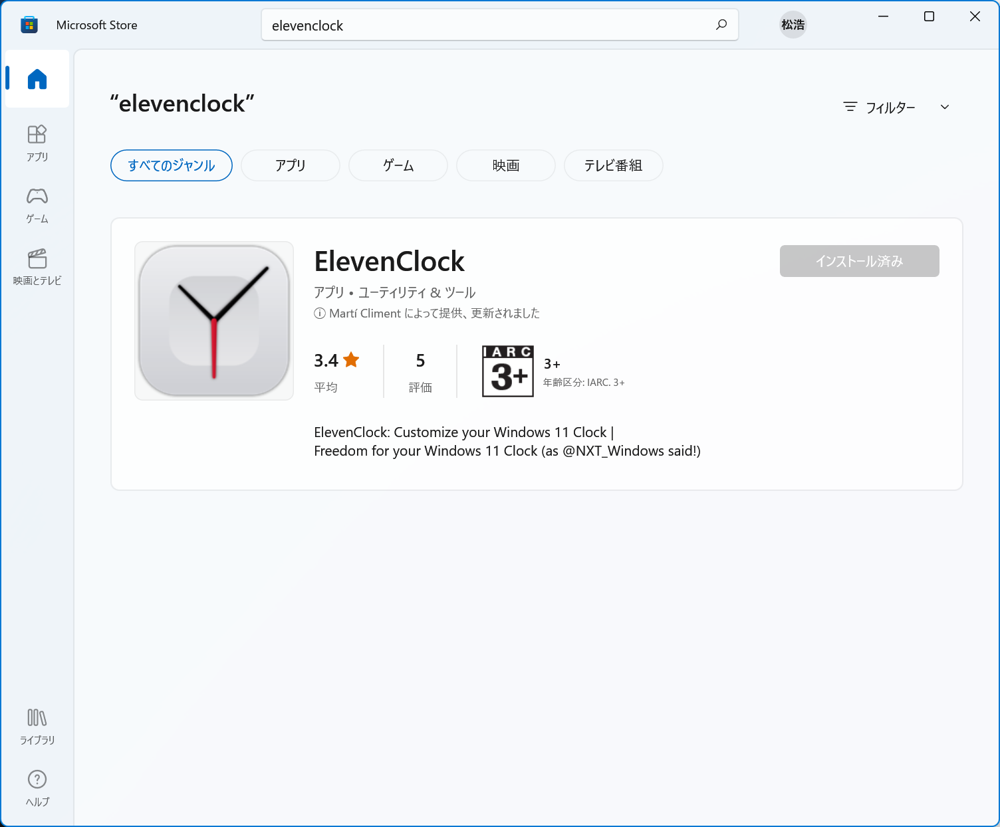
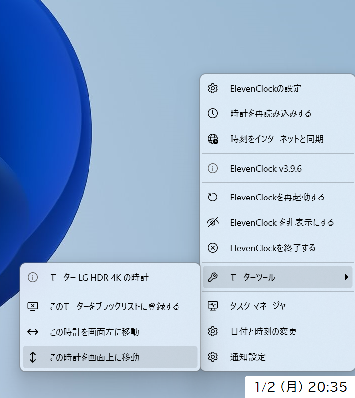
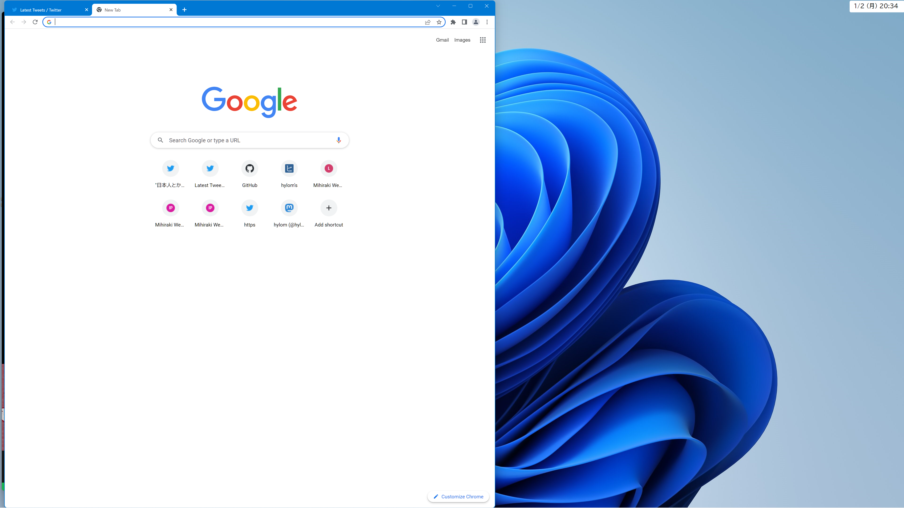

　自分は長らくタスクバーを画面上側に表示する設定でWindowsを使っていたのですが、なんとWindows 11ではタスクバーの位置変更機能が削除されてしまい、画面下部以外にタスクバーを表示することはサポート外となりました。さらに、サポート外とはいえレジストリエディタで直接設定を書き換えることでタスクバーの位置を変えることはできたのですが、ついにこの抜け道もWindows 11の最近の大型アップデートでふさがれてしまったようです。

　正直なところ、タスクバーを画面下に表示させることに関してはそこまでこだわりはないのですが（そもそもmacOSは画面下にDockがあるし）、困るのは時計です。画面右上に視線を移して日付時刻を確認する、というのが体に染みついてますし、自分はmacOSとWindowsを併用しているため、macOSでは右上、Windowsでは右下、とOS環境に応じて自らの動作をカスタマイズできる気がしません。

　ということで、Windows環境でも画面右上に時計を表示させる方法を模索してみました。結論としては、「[ElevenClock](https://github.com/marticliment/ElevenClock)」というツールを使って実現できました。

## ElevenClockについて

　ElevenClockについては[窓の杜の記事](https://forest.watch.impress.co.jp/docs/news/1392417.html)が詳しいのですが、Windows 11のタスクバーの時計表示をカスタマイズするツールです。マルチディスプレイ環境で2つめ以降のディスプレイ上に時計を表示するのが主なユースケースのようですが、設定を変えることでタスクバー上の時計はそのまま表示させておき、それに加えて画面右上に追加で時計を表示することが可能です。

　なお、ElevenClockはPython＋GUI Toolkitライブラリで実装されており、GPLv3ライセンスでソースコードも公開されているため、頑張ればより柔軟な改造も可能ではあります。また、インストーラはMicrosoft Storeでも配布されています。

## 画面右上に時計を表示させるためのElevenClock設定

　ElevenClockではフォントの種類やサイズ、日付時刻フォーマットのカスタマイズが可能です。これらを変更して好みの表示に設定した後、時計を右クリックしてコンテキストメニューから「モニターツール」-「この時計を画面上に移動」を選択します。これで時計が画面右上に表示されるようになります。

　さらに、ElevenClockの設定で「修正やその他の試験機能」内にある「既定のWindowsの時計を隠す機能を無効にする」にチェックを入れることで、タスクバー上の時計はそのまま表示しておくことができます。

　時計を画面右上に表示させることができたら、もうタスクバーにはほとんど用はないので、タスクバーの設定で「タスクバーを自動的に隠す」にチェックを入れ、通常時は非表示にしておきました。これで問題なくWindows 11のアップデートができそうです。

