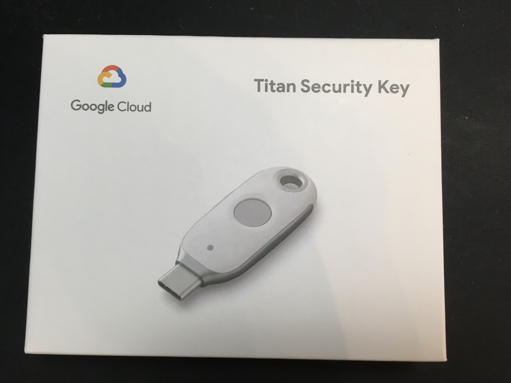
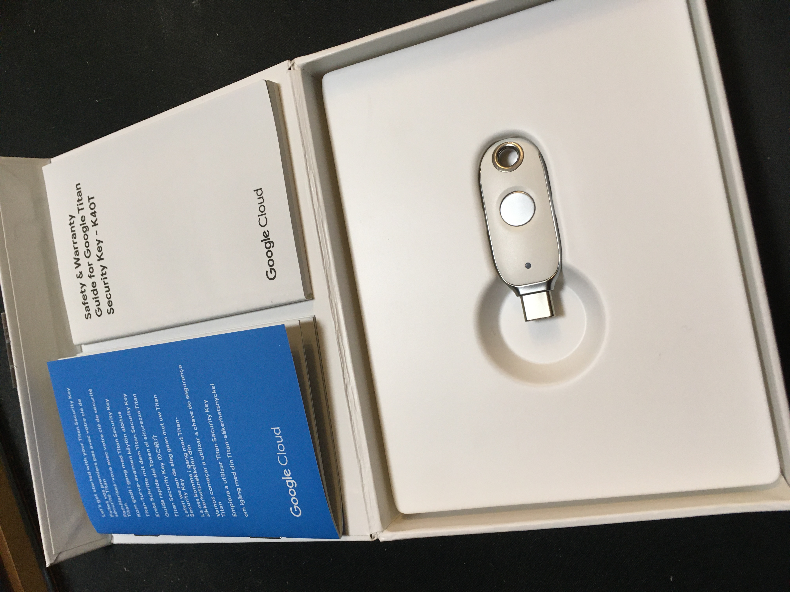
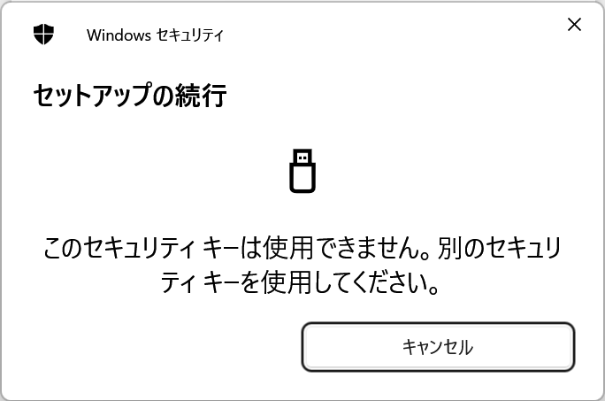
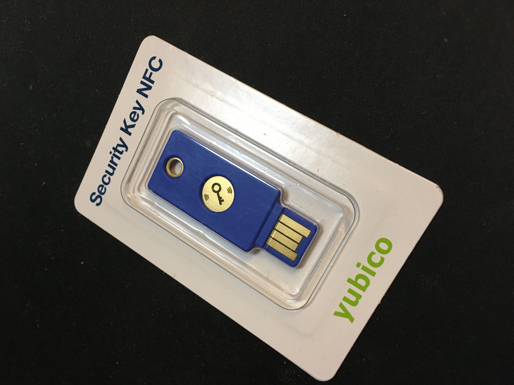
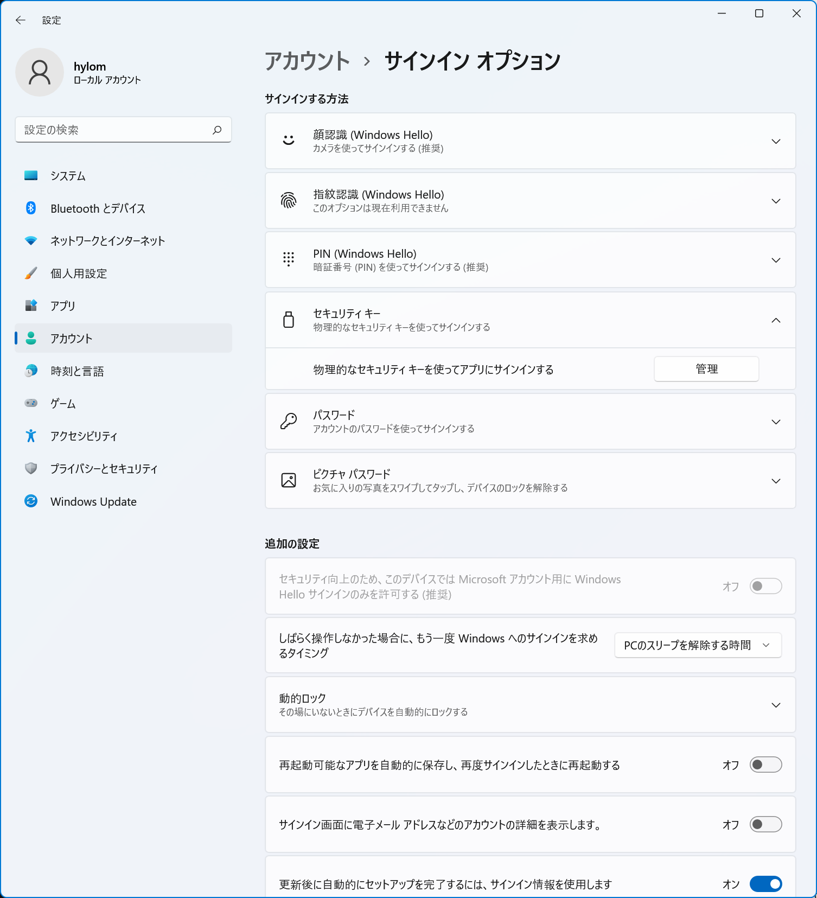
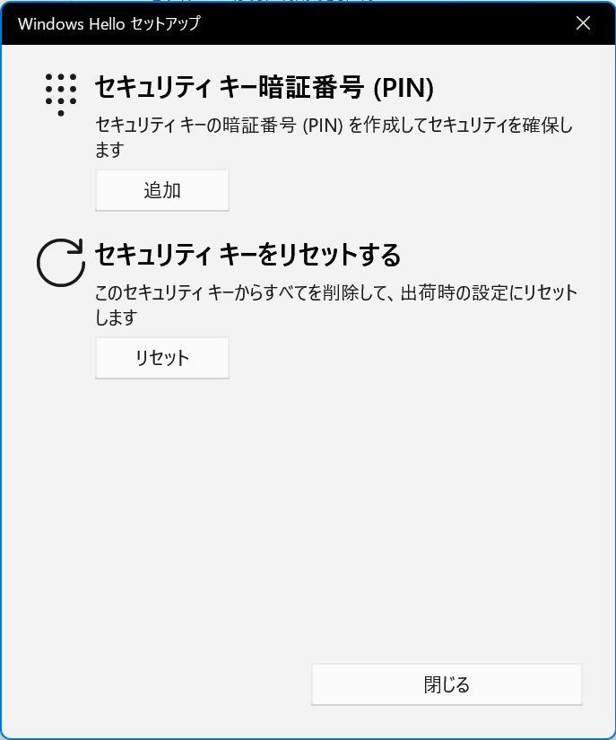

　アカウント乗っ取りへの対策として、昨今では多くのサービスが二要素認証を導入しています。二要素認証の方法としてはメールやSMSを利用するものが多いですが、それらが受信できない場合は認証ができなくなってしまうという問題があります。ということで、USB/NFCセキュリティトークンを使った二要素認証を導入してみました。

　メールやSMSを利用する二要素認証では、たとえばメールアカウントがブロックされたり、SMSを受信する端末が手元に無い場合などに認証ができません。自分はメールをGmailとYahoo!メールに依存しているため、万が一これらのアカウントがロックされてしまうとメールを利用した二要素認証を利用するサービスすべてで認証が行えなくなってしまいます。また、SMSに関しても、スマートフォンのバッテリー残量がなくなったり、出先でスマートフォンを携帯していないため受信できない、自宅でスマートフォンを鞄に入れっぱなしにしていてすぐに出てこない、といったケースがそれなりにあります。USB/NFCセキュリティトークンを利用することで、これらの問題を回避できるのではないかと期待しての導入でした。

## Google Titanセキュリティキーの導入

　まず導入したのが、「[Google Titanセキュリティキー](https://store.google.com/product/titan_security_key?hl=ja)」です。こちらについては[PC Watchの記事（Google「Titan セキュリティキー」ってどう使うの？NFCによるスマホ利用にも対応）](https://pc.watch.impress.co.jp/docs/column/yajiuma-mini-review/1459529.html)が詳しいのですが、USB Type-CポートとNFCインターフェイスの両方に対応しており、スマートフォンでもPCでも利用できる、というのがポイントです。価格は4,500円。Googleストアで購入後、2日後に到着しました。

　届いたTitanセキュリティキーはUSBメモリサイズのデバイスですが、しっかりした化粧箱に入っていました。過剰包装な感じもありますが、ちゃんと説明書が入っているのは親切ではあります。

　Googleアカウントとの紐づけはPC Watchの記事に書いてある通りで、自分のメインブラウザはFirefox、OSはWindows 11ですが、特に問題なく設定が完了し、二要素認証で利用できるようになりました。

## TitanセキュリティキーはGoogle以外では利用できない？

　続いて、Google以外でのサービスでも試してみました。Webサービスにおけるセキュリティキー利用に関しては、[FIDO2](https://fidoalliance.org/fido2/)という共通規格があり、FIDO2をサポートしているサービスではセキュリティトークンの利用が可能な
はずです。FIDO2のサポートをうたう代表的なサービスとしては、GoogleアカウントのほかMicrosoftアカウント、Facebook、Twitter、ヤフーなどがあります。

　ということで、まずはネットで利用事例があるMicrosoftアカウントへのTitanセキュリティキーの紐づけを試してみました（参考記事：[ASCII.jp：Windows 10＋FIDO2デバイスでパスワード入力なしにMicrosoftアカウントにログイン](https://ascii.jp/elem/000/001/841/1841828/)、[ケータイWatch：Microsoft アカウントで使えるようになったFIDO2セキュリティキーを試してみた](https://k-tai.watch.impress.co.jp/docs/column/todays_goods/1158600.html)）。しかし、記事どおりの手順を試してみても、「このセキュリティキーは使用できません」というエラーが出てセットアップが進みません。

　これはどういうことなんだと調べた結果、Titanセキュリティキーがサポートしているのは「FIDO U2F」という規格で、FIDO2とは異なる規格なのだそうです。そのため、TitanセキュリティキーではFIDO2が必要なサービスを利用できないということが分かりました。U2Fに対応しているサービスとしてはGitHubやFacebook、Dropboxなどがあるとのことですが、MicrosoftアカウントはU2Fには対応していないため利用できないようです。

## FIDO2対応セキュリティキーの導入

　前述のように、自分はヤフーメールとGmailをメールによる二要素認証の送信先として利用しています。GmailはTitanセキュリティキーによる二要素認証に対応していますが、ヤフーメールもどうにかして二要素認証を利用したいところです。ということで、FIDO2対応のセキュリティキーも購入することにしました。FIDO2対応セキュリティキーとしては、Yubicoというメーカーの製品と、飛天ジャパンというメーカーの製品が比較的入手しやすいようです。今回はYubicoのUSB Type-A接続およびNFCに対応するセキュリティキーを購入してみました。入手しやすいといっても、家電量販店等ではほぼ扱われておらず、個人が買うならほぼAmazon.co.jp一択のようです。価格は5,500円でした。

<iframe sandbox="allow-popups allow-scripts allow-modals allow-forms allow-same-origin" style="width:120px;height:240px;" marginwidth="0" marginheight="0" scrolling="no" frameborder="0" src="//rcm-fe.amazon-adsystem.com/e/cm?lt1=_blank&bc1=000000&IS2=1&bg1=FFFFFF&fc1=000000&lc1=0000FF&t=hylom-22&language=ja_JP&o=9&p=8&l=as4&m=amazon&f=ifr&ref=as_ss_li_til&asins=B07M8YBWQZ&linkId=990984412fdeecdc72705a47c7b84917"></iframe>

　こちらも注文してから2日ほどで手元に届きました。こちらは厚さ2～3mmほどのデバイスなので、パッケージは簡素です。取扱説明書はありませんが、まあ問題ないでしょう。

## PINの設定

　FIDO2対応のセキュリティキーでは、まずデバイスにPIN（暗証番号）を登録する必要があります。これは、セキュリティキーをPCに接続した状態でWindowsの「設定」-「アカウント」-「サインインオプション」画面内にある「セキュリティキー」-「管理」から行えます。

　セキュリティキーを接続した状態で指示に従って操作すると、「セキュリティキー暗証番号（PIN）」と表示されたダイアログが表示されるので、ここで「追加」ボタンをクリックして、PINを登録します。登録できるPINの長さは4～63文字だそうです。

　これでここで登録したPINを使って認証が行えるようになります。

## Microsoftアカウントにセキュリティキーを紐づける

　続いてMicrosoftアカウントにセキュリティキーの紐づけを行ってみました。手順に関しては前述のケータイWatchやASCII.jpの記事に記載してある通りです。なお、ケータイWatchの記事では言語設定を英語に変更するという手順が記載されていましたが、自分の環境では日本語環境のままで問題なく設定が可能でした。また、セキュリティキーを紐づけると、Microsoftアカウントのログイン時に、パスワードではなくセキュリティキーのPINの入力とセキュリティキーへのタッチが求められるようになります。

　なお、Microsoftアカウントではログイン時の「サインインオプション」に「セキュリティキー」という選択肢があります。これを利用すると、登録メールアドレスの入力なしにセキュリティキーだけでログインができるように見えるのですが、自分の環境ではこちらはエラーとなり利用できませんでした。

## ほかのサービスでセキュリティキーを紐づける

　続いて、FacebookやTwitterでもセキュリティキーの紐づけを行ってみましたが、こちらも問題なく紐づけができました。ただ、ヤフーに関しては[設定ページ](https://id.yahoo.co.jp/security/manage_auth_device_winmac.html)を開いても、「 現在アクセスしている環境では登録ができません」と表示され設定が行えませんでした。[プレスリリース：ヤフー、パソコンでも「FIDO2」規格に準じた指紋・顔認証を利用したログインに対応](https://about.yahoo.co.jp/pr/release/2021/12/09a/)に書いてある環境のはずなのですが、ここでは「指紋・顔認証」と書いてあるので、セキュリティトークンによる認証には非対応のようです。

　ということで、結局ヤフーのアカウントをセキュリティトークンベースの二要素認証に対応させることはできませんでした。自分が実現したいのは、「物理トークンさえあれば
任意のデバイスから二要素認証を使ってログインできる」ことなので、ヤフーさんには頑張ってもらいたいところです。
