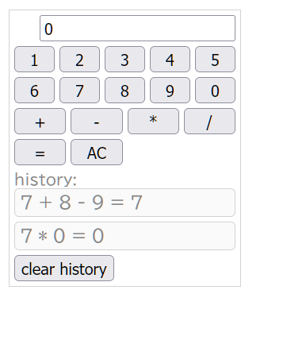

　毎年連休は1人ハッカソン的なものをひっそりとやっています。テーマは行き当たりばったり、車輪の再発明も気にしない、とりあえず期間内で動くものを作る、無理をしない、あたりがルールです。今年はEvernoteの値上げが話題になっていたのでEvernote的なものでも作ろうかと思っていたのですが、その途中で使っていた自前WebフレームワークがうまいことWebComponent対応できてしまったので最終的にこちらを作りこむことに。見事な本末転倒です。

## WebComponentの話

　WebComponentについては[MDNの解説記事](https://developer.mozilla.org/ja/docs/Web/API/Web_components)がとても詳しいですが、簡単に言えばJavaScriptで独自のHTMLタグを実装できる仕組みです。昨今広く使われているReactやVue.jsといったフレームワークも雑に言えば独自タグのようなコンポーネントを組み上げてアプリケーションを実装していくものですが、WebComponentがこれらと異なるのは、Webブラウザがネイティブで備えている仕組みを使っている点です。そのため、適切に実装さえ行えば再利用性が高く、作成したコンポーネントは（基本的には）どのようなフレームワークとも組み合わせて利用できるというのが利点です。

　いっぽうで、ReactやVue.jsのように1つのファイルにHTMLとCSSとコードをまとめて記述できる単一ファイルコンポーネントのような仕組みは提供されていないため、その点ではやや実装しにくい、理解しにくい、というハードルもあります。

　また、ReactやVue.jsの別の特徴として、仮想DOMという、画面上に表示されているものとは異なる形式でメモリ上にドキュメントを保持し、それを利用してドキュメントが変更された際に高速にコンテンツ描画を行う、というものがあります。WebComponentは標準ではこういった仕組みを備えていないため、実装によってはパフォーマンス面で問題が発生する可能性もあります。

## 仮想DOMを使わずにコンポーネントを実装する

　ReactやVue.jsは便利でとても使いやすいのですが、開発環境を構築する際にはたくさんの依存ライブラリをインストールする必要がありますし、リリース向けにビルドされるコードも依存ライブラリの関係で大きくなりがちです。そのため、たとえばブログやメディアサイトといった、単純にコンテンツを表示するだけの部分が多いサイトの一部のみで利用したいといった場合（たとえばログインフォームを含むドロップダウンメニューを作りたい、等）、やや使いにくい印象があります。いっぽうで、昨今のWebブラウザが備えるDOM APIは非常に強力で、かつてのjQueryのような別途ライブラリ等を導入しなくとも、簡単に複雑な操作も実装できるようになっています。

　ということで、以前[jumon-js](https://github.com/hylom/jumon-js)という、HTML要素に属性としてマークアップを行うことで、それらの要素にアクセスできるオブジェクトを作成できるようにする仕組みを実装しました。たとえば次のように、`<input>`タグに`jumon-bind="width"`のような感じでプロパティ名を指定したHTMLを用意します。

```
<form>
  <input value="50" jumon-bind="width" jumon-type="Number">
  <input value="100" jumon-bind="height" jumon-type="Number">
</form>
```

　これに対し、次のように`Jumon`クラスのオブジェクトを作成すると、そのオブジェクトの`width`プロパティ経由でHTML要素の値を取得したり設定できるようになる、というものです。

```
import { Jumon } from './jumon.js';
const parameter = new Jumon();
```

```
// read text box's values
console.log(parameter.width);
console.log(parameter.height);

// update text box's value
parameter.width = 100;
parameter.height = 200;
```

　これ自体はJavaScriptの[Object.defineProperty()](https://developer.mozilla.org/ja/docs/Web/JavaScript/Reference/Global_Objects/Object/defineProperty)などの機能を使って動的にgetter/setterを追加する、みたな感じで実装した簡単なものなのですが、この仕組みにちょっと手を入れるだけでWebComponentの実装に応用できることに気付いて実装したものが今回紹介する`jumon-component`になります。

## 実装例とその説明

　`jumon-component`は、テンプレートとなるHTMLおよびCSS、動作を定義するクラスの3つを用意して`makeComponent()`メソッドを実行するだけでWebComponentを実装できます。現状ではHTMLとCSSはJavaScriptファイル内にテンプレートリテラルとして埋め込んでいますが（簡単なヒストリ機能を備える電卓を実装した[サンプルコード](https://github.com/hylom/jumon-js/blob/dev/example/calculator/tiny-calculator.js)）、ちょっと頑張ってWebpackのプラグインを作れば簡単に単一ファイルコンポーネントのような形式で実装することも可能でしょう。




　テンプレートでは、各HTMLタグに`jumon-`で始まる属性を指定することで、WebComponentで指定したクラスのプロパティとのひも付けを行います。たとえば次のように`jumon-text="operation"`を指定すると、WebComponentオブジェクトの`.operation`プロパティの値が自動的にそのタグの`textContent`になります。

```
<div class="indicator">
  <span class="operation" jumon-text="operation"></span>
  <input class="value" jumon-bind="currentValue" jumon-type="Number" value="0">
</div>
```

　`jumon-bind`も似たような動作をしますが、プロパティが`textContent`ではなく`value`にひも付けられる点が異なります。こちらはフォーム要素などでの利用を想定しています。

　イベントハンドラは`jumon-listener`属性で指定できます。値は`{イベント名}:{メソッド名}`で指定します。たとえば`click:setOperation('+')`を指定した場合、この要素がクリックされた際にWebComponentオブジェクトの`setOperation()`というメソッドが`'+'`という引数で実行されます。

```
<div class="action-buttons">
  <button jumon-listener="click:setOperation('+')">+</button>
  <button jumon-listener="click:setOperation('-')">-</button>
  <button jumon-listener="click:setOperation('*')">*</button>
  <button jumon-listener="click:setOperation('/')">/</button>
  <button jumon-listener="click:run()">=</button>
  <button jumon-listener="click:allClear">AC</button>
</div>
```

　Array型のプロパティに対してテンプレートを紐づける`jumon-foreach`属性もあります。ここではWebComponentオブジェクトの`histories`プロパティに`<div class="history-item" jumon-text="history"></div>`というテンプレートを紐づけており、この`histories`プロパティに対する`push()`や`pop()`、添え字アクセスによる代入等で動的に要素の挿入・削除が可能です。

```
<div class="history-items">
  <template jumon-foreach="history in histories">
    <div class="history-item" jumon-text="history"></div>
  </template>
</div>
```

　WebComponentに紐づけるクラスについては、`HTMLElement`のサブクラスである必要はありますが、それ以外は任意に実装が可能です。ただし`connectedCallback`などに代表されるWebComponentのライフサイクルコールバックについては`jumon-component`側で隠蔽しているため、これらが必要な場合は代わりに`connected`や`disconnected`、`adopted`、`attributeChanged`といったメソッドを定義します。もちろんこれらをまったく定義しなくとも利用可能です（下記は実際に作成したクラスの抜粋）。

```
class TinyCalculator extends HTMLElement {
  constructor() {
    super();
    this._isEntered = false;
    this._lastValue = 0;
    this._stack = [];
  }
  setNumber(num) {
    if (this._isEntered) {
      this.currentValue = num;
      this._isEntered = false;
    } else {
      this.currentValue = this.currentValue * 10 + num;
    }
  }
  setOperation(operation) {
    if (!this.operation) {
      this._stack.push(this.currentValue);
    }
    if (!this._isEntered) {
      this._isEntered = true;
      this._lastValue = this.currentValue;
      //this._stack.push(this.currentValue);
      if (this.operation) {
        this.run(true);
      }
    }
    this.operation = operation;
  }
```

　クラス、HTML（文字列）、CSS（文字列）の3点を用意したら、これらを引数として`makeComponent()`メソッドを実行すると、WebComponentが作成されます。`makeComponent()`メソッドの第一引数に与えた文字列が作成されたWebComponentのタグ名となります。

```
makeComponent("tiny-calculator", template, {
  baseClass: TinyCalculator,
  styleSheet: css,
});
```

　作成したコンポーネントは一般的なHTMLタグと同様の形で利用できます。

```
<!doctype html>
<html>
<head>
  <meta charset="utf-8">
  <meta name="viewport" content="width=device-width, initial-scale=1">
  <title>Tiny Calculator Demo</title>
  <script type="module" src="./tiny-calculator.js"></script>
</head>
<body>
  <tiny-calculator></tiny-calculator>
</body>
</html>
```

## 今後の展望

　このように、ひとまず最低限動く仕組みを実装はしていますが、実用しようとするともう少し機能拡充は必要でしょう。現在不足しているものとして、`jumon-foreach`で紐づけた`array`オブジェクトの操作として`push`、`pop`、`unshift`、`shift`、`splice`しかサポートしていない点と、WebComponentタグの属性サポートを現状一切考慮していない点があります。特に属性サポートはコンポーネントを組み合わせてアプリケーションを実装する際には必須と言えるもののため、ぜひ実装したいところではあります。

