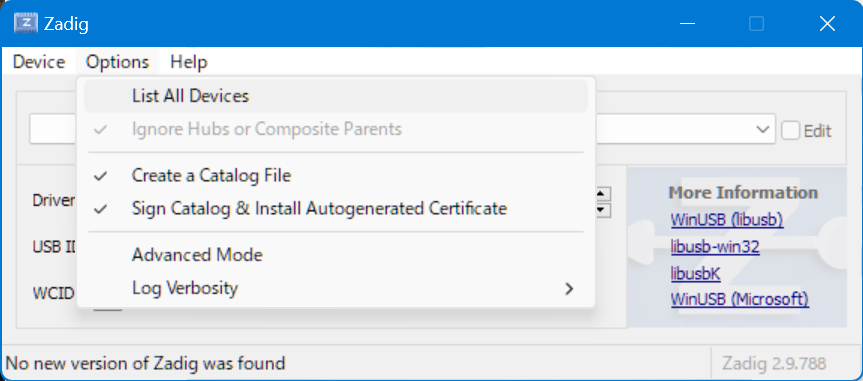
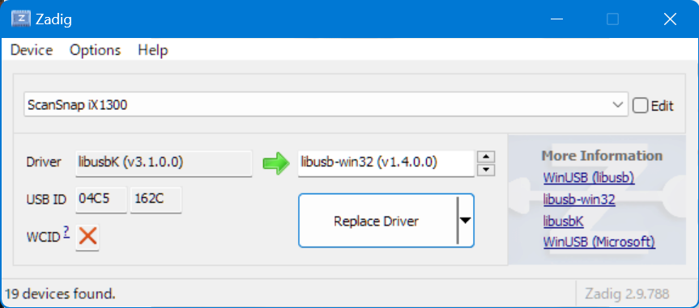

　書籍や漫画単行本をスキャンして電子化する作業（いわゆる自炊）のためにScanSnap iX1300というドキュメントスキャナを購入したのですが、画質面ではイマイチのようです。そこで、SANEというオープンソースのスキャナライブラリを使ってこの問題への対処を図ってみました。

## ScanSnapの画質問題とSANE

　書籍・単行本の電子化自体は以前から少しずつ進めており、これまではEPSONのDS-310というドキュメントスキャナを使用していました。DS-310は比較的安価でコンパクトなのにスキャンがそれなりに速く、画質も問題ないレベルだったために満足していたのですが、久しぶりに使ったところスキャンした画像の一部がグレー一色になってしまうという問題が発生するようになりました。状況から察するにセンサーの故障のようで、この機種ではよくある問題のようです。ただ、すでにこの製品は終売しており、保証期間も過ぎています。そのためScanSnap iX1300を購入したのですが、使ってみたところすぐに以下のような不満点が浮かんできました。

 * 画像や写真をスキャンすると目立つレベルでノイズが出る
 * 生成された画像のファイルサイズが妙に大きい
 * 専用のスキャンソフトウェアは常時バックグラウンドで起動しっぱなしの状態になり、終了もできない

　いくつか試してみたところ、どうもScanSnapは全体的にシャープネスとコントラストが強い画質にチューニングされているようです。これは書類などの文字がメインの印刷物をスキャンするのには適していますが、写真や画像、イラストなどのスキャンにはあまり向いていません。この問題はScanSnap iX1300だけでなく他の機種でも発生するようで、ネットで検索するといくつかScanSnapの画質について言及するページが見つかりました。

　ただ、専用スキャンソフトウェアの構成ファイルを観察してみると、どうも画像の圧縮は本体側ではなくこの専用ソフトウェア側で実行されている雰囲気があります。しかし、TWAINやWIAなどの汎用インターフェイスに対応していればWindowsの標準スキャン機能やサードパーティの画像処理ソフトウェアでスキャンできるのですが、残念ながらScanSnapはこれらのインターフェイスを提供していません。

　ところが、なんとオープンソースのスキャナライブラリである[SANE](http://www.sane-project.org/)はUSB接続に限定されるもののScanSnapシリーズにも対応しており、動作検証もされているようです。ということで、このSANEを使ったスキャンを試してみることにしました。

## MacでSANEを使う

　SANEは主としてLinuxなどのUNIX系OS向けに開発されています。そのため、LinuxやmacOSでは容易に導入が可能です。DebianなどのLinuxディストリビューションでは標準でパッケージが提供されていますし、macOSでもHomebrewというパッケージマネージャ経由でインストールが可能です。

```
$ brew install sane-backends
```

　もちろん、自前でソースコードからビルドすることもできます（自分はソースコードからビルドを行いましたが、特に詰まることもなくビルドができました）。

　SANEはスキャナにアクセスする汎用APIを提供するという位置付けのソフトウェアで、一応「scanimage」というコマンドラインから操作するスキャンソフトウェアも付属しています。SANEのAPIに対応したGUIのスキャンソフトウェアもありますが、今回はひとまずこのscanimageでスキャンを試してみました。

　次の例は、グレースケール、300dpi、読み込みサイズ115×175mm、JPEG形式でスキャンを行い、「test.jpeg」というファイル名でスキャン結果を保存するものです。

```
$ scanimage -d fujitsu --source="ADF Duplex" --mode=Gray --resolution=300 --page-width=115 --page-height=175 --format=jpeg -o test.jpeg
```

　この場合は片面のみのスキャンになりますが、「-b」オプションを使えば両面で連続スキャンを行うことができます。

```
$ scanimage -d fujitsu --source="ADF Duplex" --mode=Gray --resolution=300 --page-width=115 --page-height=175 --format=jpeg -b
```

　なお、macOSの場合ではSANEを使用する場合でも純正ドライバをインストールしておく必要があるようです。

　下記の画像はScanSnap公式ソフトウェアでスキャンしたものとSANE経由でスキャンしたものを比較したものですが、このようにScanSnap公式ソフトウェアの場合は文字の周りに歪んだような汚れが目立つのに対し、SANEでスキャンしたものは若干ぼやけた感じにはなっているものの、目立つ汚れは少ない傾向になり、またファイルサイズもJPEG形式の場合でおおむね3分の2～半分程度になりました。


## WindowsでSANEを使う

　SANEは現在公式にはWindowsをサポートしていないようですが、試したところMSYS2というUNIX互換の開発環境を使えばビルドが可能でした。MSYS2経由でバイナリパッケージをインストールすることもできるのですが、試したところ動作に怪しいところがあったため、以下では自前でビルドしてインストールしています。一部のスキャナ向けコードはそのままではビルドできないようですが、ScanSnap用のドライバに関しては問題なく利用できました。

### MSYS2環境の構築

　[MSYS2](https://www.msys2.org/)は、Windows環境でいわゆるUNIX系OS向けのソフトウェアを利用・ビルドするためのプラットフォームです。動作環境はWindows 10以降（64ビット専用）です。MSYS2のWebサイトでインストーラが公開されているので、こちらをダウンロードして指示に従ってインストールします。

#### MSYS2の環境について

　MSYS2では、使用するコンパイラやCランタイムが異なる複数の環境が用意されており、それぞれの環境のシェルを起動するショートカットが用意されています。

　環境について詳しくは[Environments](https://www.msys2.org/docs/environments/)ドキュメントで解説されていますが、今回はコンパイラとしてGCC、CランタイムとしてUCRTを使用する「ucrt64」環境を使用しています。

　ちなみにUCRTはWindows 10以降で利用できる互換性の高いランタイムで、詳しくは[Microsoftの公式ドキュメント](https://learn.microsoft.com/ja-jp/cpp/porting/upgrade-your-code-to-the-universal-crt?view=msvc-170)で説明されています。

　MSYS2で提供されているソフトウェアやライブラリの一部は環境ごとに異なるパッケージで提供されているため、必要に応じて適切なパッケージをインストールする必要があります。たとえばucrt64環境向けのパッケージは「mingw-w64-ucrt-x86_64-」というプレフィックスが付いています。

### 必要なパッケージのインストール

　MSYS2環境では多数のコンパイル済みパッケージが提供されており、「pacman」というパッケージマネージャを使ってそれらをダウンロード/インストールできます。提供されているパッケージを探すには、[MSYS2 Packages](https://packages.msys2.org/packages)が便利です。

　パッケージをインストールするには、「pacman -S ＜パッケージ名＞」コマンドを使用します。下記のパッケージをインストールすることで、一般的なソフトウェアのビルド環境を構築できます。

```
make
mingw-w64-ucrt-x86_64-autotools
mingw-w64-ucrt-x86_64-gcc
autoconf-archive
patch
```

　SANEのビルドにはこれに加えて、下記のパッケージが必要です。

```
mingw-w64-ucrt-x86_64-python
git
mingw-w64-ucrt-x86_64-libusb
mingw-w64-ucrt-x86_64-libjpeg-turbo
mingw-w64-ucrt-x86_64-libpng
mingw-w64-ucrt-x86_64-libtiff
```

　Python以外はオプショナルですが、libusbがないとUSB接続のスキャナが使えず、またlibjpeg-turboやlibpng、libftiffはそれぞれJPEG（とPDF）、PNG、TIFF形式での出力に必要なのであったほうが良いでしょう。

### ソースコードの入手

　SANEのソースコードは[GitLabのsane-projectリポジトリ](https://gitlab.com/sane-project/backends)から入手できます。ここで「コード」ボタンをクリックするとclone用のURLやダウンロードリンクが表示されます。今回はHTTPS用のURLを使ってクローンし、記事執筆時点での最新バージョンに対応するタグである「1.3.1」を「msys2」というブランチ名でチェックアウトしています。

```
$ cd ＜適当なディレクトリ＞
$ git clone https://gitlab.com/sane-project/backends.git
$ cd backends
$ git checkout -b 1.3.1 msys2
```

### パッチの適用

　GitHub状にあるMSYS2のリポジトリでは、MSYS2で提供されているパッケージをMINGWでビルドするためのファイルが公開されており、ここで[SANE用のパッチ](https://github.com/msys2/MINGW-packages/blob/master/mingw-w64-sane/001-fix-build-on-mingw.patch)も公開されています。前述のようにこれだけでは正常には動作しないのですが、ビルドの際に問題となる多くの部分がこのパッチで修正されているため、まずはこちらを適用します。このパッチをダウンロードし、ソースコードが含まれるトップディレクトリで次のように実行します。

```
$ patch -p1 < ../001-fix-build-on-mingw.patch
```

　また、これに加えていくつか修正が必要と思われる部分を見つけたので、そちらも修正しました。[sane-1.3.1-msys2.patch](/pub/sane-1.3.1-msys2.patch)というパッチにまとめたので、こちらも同様に適用できます。

```
$ patch -p1 < ../sane-1.3.1-msys2.patch
```

### ビルド

　ビルドは一般的なUNIX系OS向けソフトウェアと同じような手順でビルド可能です。まず、配布ソースコードに含まれている「autogen.sh」を実行してconfigureファイルを生成します。

```
$ ./autogen.sh
```

　続いてconfigureを実行するのですが、ここで使用するバックエンド（各スキャナハードウェア固有の処理が実装されたもの。「device」や「driver」とも呼ばれる）を選択します。そのままではWindows環境でビルドできないものも含まれているので、実際に使いたいものだけを選択しておくことをおすすめします。また、テスト・デバッグ用の「test」というバックエンドも用意されているので、こちらもビルドしておくと検証に役立ちます。

　さらに、指定するオプションによっても正常にビルドできない可能性があります。今回はMSYS2のパッケージビルドスクリプトを参考に下記の設定で実行しました。

```
./configure BACKENDS="fujitsu test" PRELOADABLE_BACKENDS="fujitsu test" CFLAGS="-Wno-implicit-function-declaration -Wno-int-conversion -Wno-incompatible-pointer-types" --disable-locking --disable-rpath --disable-shared
```

　正常に処理が完了したら、makeコマンドでビルドを行います。

```
$ make
```

　ビルドが完了したら、「make install」コマンドでインストールが行えます。また、ソースコードに手を入れながらビルドして試行錯誤する場合などは、インストールを行わずに「./frontend/scanimage.exe」を直接実行することも可能です。ただし、その場合事前に利用するバックエンドに対応する設定ファイルを設定ディレクトリ（ucrt環境の場合は/ucrt64/etc/sane.d）に配置しておく必要があります。設定ファイルのひな形は「backend」ディレクトリ内に、「＜バックエンド名＞.conf」というファイルで用意されているので、これを適宜コピーしておきます。

```
$ mkdir /ucrt64/etc/sane.d
$ cp backend/test.conf /ucrt64/etc/sane.d/
$ cp backend/fujitsu.conf /ucrt64/etc/sane.d/
```

### テスト

　スキャナが接続されていない状態でも、「test」バックエンドを使ってSANEやscanimageが正常に動作するかを検証できます。たとえば次のように実行すると、「test.tiff」というファイル名で、マス目上のテスト画像が生成されるはずです。

```
$ ./frontend/scanimage.exe -d test --test-picture=Grid -o test.tiff
```

### デバッグ

scanimageの実行時に「SANE_DEBUG_＜バックエンド名＞」環境変数を設定することでテスト用メッセージを表示できます。値にはデバッグレベル（数値）を指定します。

```
$ SANE_DEBUG_TEST=1 ./frontend/scanimage.exe -d test --test-picture=Grid -o test.tiff
[21:48:21.196960] [sanei_debug] Setting debug level of test to 1.
[21:48:21.198227] [test] sane_init: SANE test backend version 1.0.28 from sane-backends 1.3.1.1-685c1-dirty
```

デバッグレベルとして指定する数値を大きくすると、より多くのログが表示されます。

```
$ SANE_DEBUG_TEST=2 ./frontend/scanimage.exe -d test --test-picture=Grid -o test.tiff
[21:49:42.818044] [sanei_debug] Setting debug level of test to 2.
...
```

### 汎用USBドライバの設定

　Windows環境におけるSANEの制約として、対象のスキャナに汎用ドライバ（libusb）がひも付けられている必要があります。これは、[Zadig](https://zadig.akeo.ie/)というツールを使って実行できます。ただし、一度対象のScanSnapデバイスにlibusbドライバをひも付けると、そのデバイスは（libusbドライバを削除するまでは）ScanSnap公式ソフトウェアからは使用できなくなります点に注意してください（この場合でも無線接続なら公式ソフトウェア経由でもスキャンできそうな気もするのですが、自分は前述のソフトウェア常駐問題があったためすっぱりとアンインストールしてしまったため試せていません）。

　Zadigをダウンロードして起動したら、「Options」メニューの「List All Devices」を選択します。

]

　するとドロップダウンリストで接続されているUSBデバイスを選択できるようになるので、ここで対象のScanSnapを選択し、続いて使用するドライバとして「libusb-win32」もしくは「libusbK」を選択します。一応微妙に機能に違いがあるようなのですが、SANEから使う限りは特に違いは感じられませんでした。最後に「Replace Driver」をクリックするとドライバがインストールされ、指定したデバイスへのひも付けが行われます。

]


### scanimage.exeでスキャンを実行する

　SANEとドライバの両方の設定が完了すると、macOSの場合と同様にscanimage.exeでスキャンが実行できます。

　次の例は、グレースケール、300dpi、読み込みサイズ115×175mm、JPEG形式でスキャンを行い、「test.jpeg」というファイル名でスキャン結果を保存するものです。

```
$ scanimage.exe -d fujitsu --source="ADF Duplex" --mode=Gray --resolution=300 --page-width=115 --page-height=175 --format=jpeg -o test.jpeg
```

　この場合は片面のみのスキャンになりますが、「-b」オプションを使えば両面で連続スキャンを行うことができます。

```
$ scanimage.exe -d fujitsu --source="ADF Duplex" --mode=Gray --resolution=300 --page-width=115 --page-height=175 --format=jpeg -b
```

　Windows環境ではコードの修正（実質的にデバッグ）が必要だったため若干手間がかかりましたが、ひとまずこれで問題なく実用ができそうです。
