　今まで使っていたiPad Air（第三世代）からの置き換えとして[Lenovo Yoga Tab（11.1インチ、2025年モデル）](https://www.lenovo.com/jp/ja/p/tablets/yoga-tab-series/lenovo-yoga-tab/len103l0031)を購入しました。初めてのAndroidタブレットと言うことで若干の不安があったのですが、結果としては大きな不満点はなく良いデバイスでした。ということで以下簡単なレビューです。

## 購入経路とパッケージ、本体デザイン

　今回はLenovo公式の直販サイトで購入しました。価格は税込みで6万3,800円。ちょうどキャンペーンで「1年間 アクシデント・ダメージ・プロテクション」が99円だったのでこちらも追加しています。こちらはAppleの「Apple Care+」に相当するようなサービスで、画面破損等についても無料修理の対象になるようです。発売直後の9月26日に注文したためか出荷まで1週間程度という表示でしたが、結果としてはおよそ6日後の10月2日に手元に届きました。

　パッケージはこのような簡素なものですが、デジタル製品としては十分な感じです。

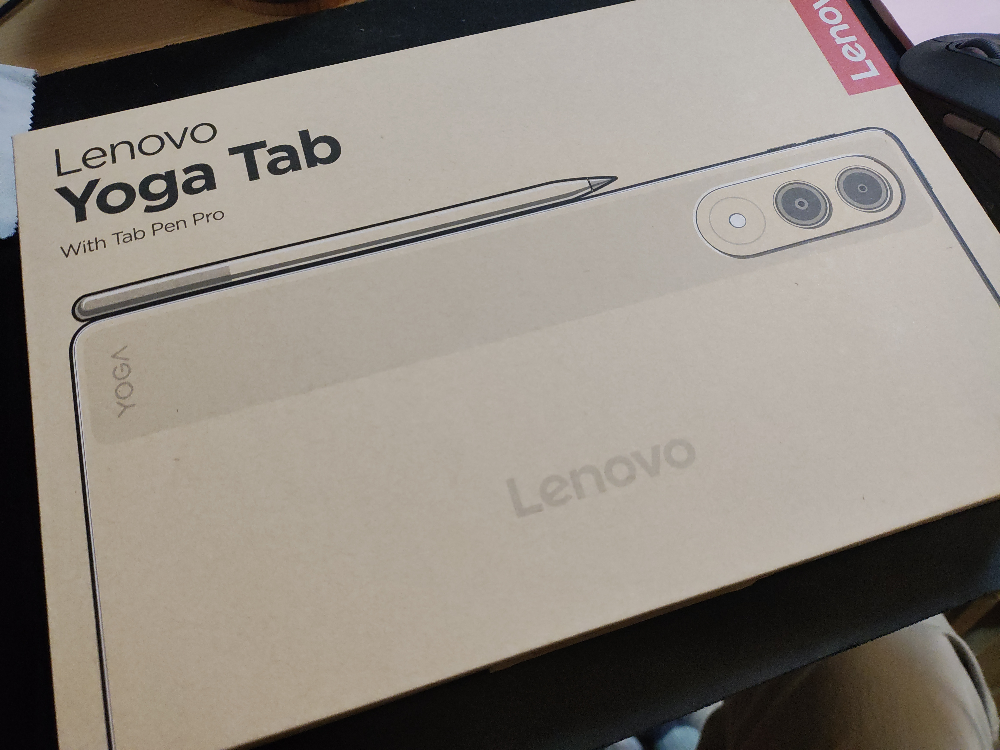

　パッケージを開けるとまずは本体が入っており、その下にペン、充電器、保証書、USB type-Cケーブルが収められています。

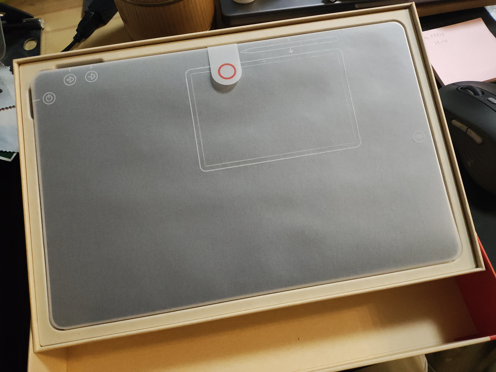

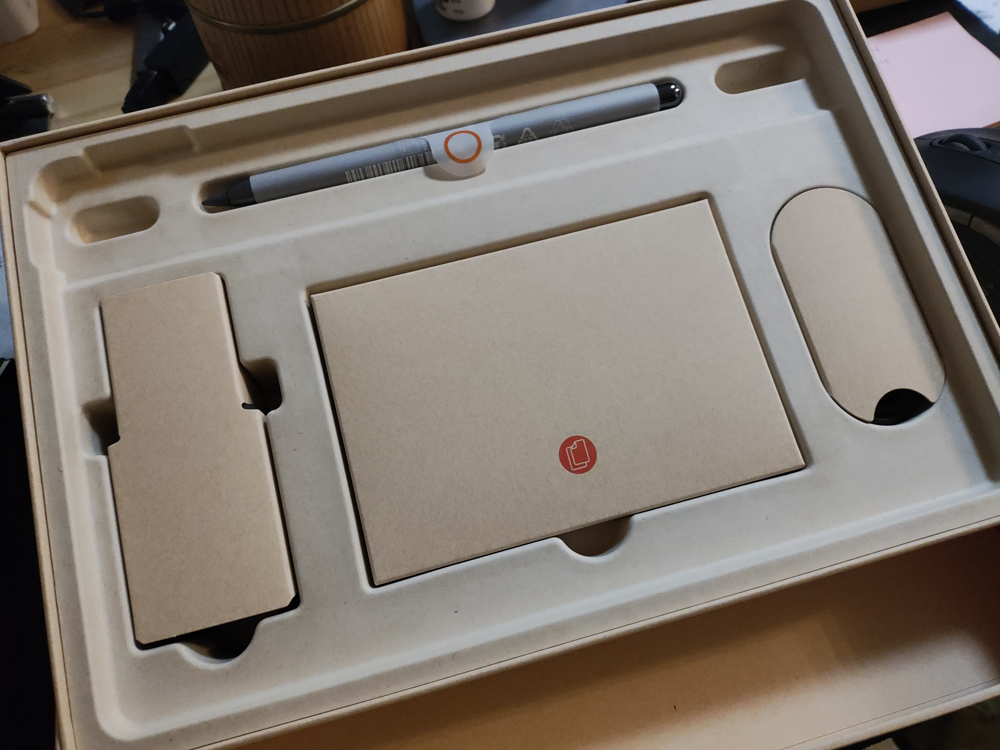

　充電器は最大45W出力（5V/3A、9V/3A、12V/3A、5～11V/4.5A）とのことで、高速充電に対応しています。

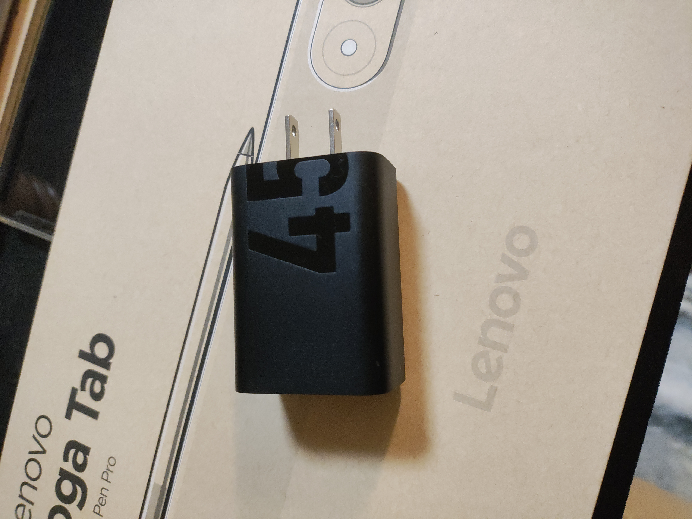

　ペンは高級感のあるデザインです。ペン先の交換も可能で、予備のペン先が1つ付属していました。

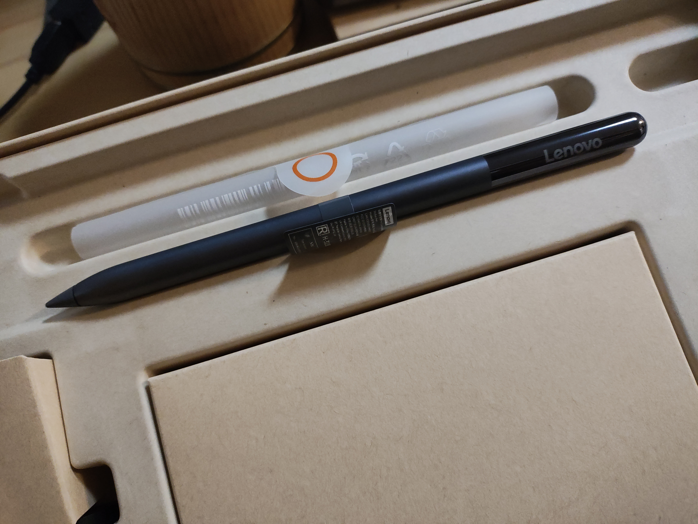]

　Apple Pencil（初代）と比べると少し短く、重量も若干軽いため取り回しやすそうです。有線での充電には対応しておらず、第2世代Apple Pencilのように本体にマグネットで取り付けることで充電します。

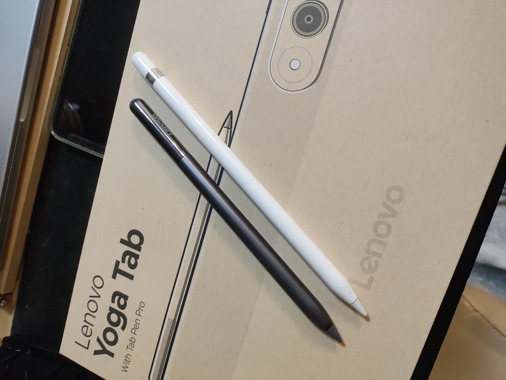

　本機は画面解像度が3200×2000ドット（16:10）ということもあってiPadよりも縦長なフォルムです。ただし縦持ちした場合の高さはiPadとほぼ同じで、その分幅が狭くなっています。

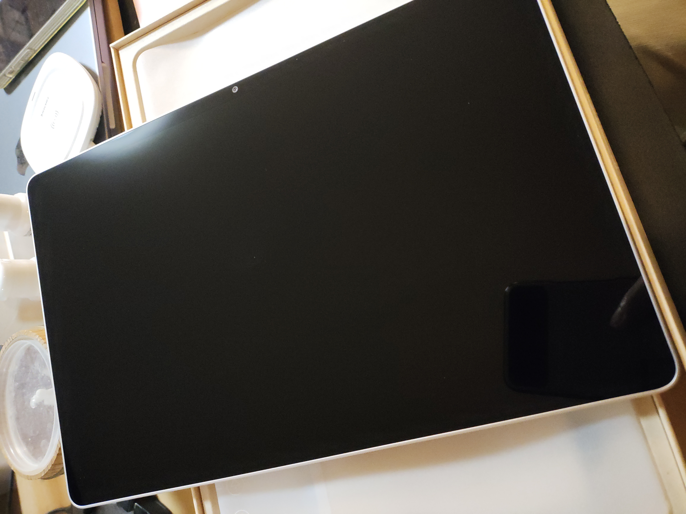

　背面にはカメラ×2とフラッシュ（LED）を搭載。技適マークやシリアルナンバーがシールで貼られている点はデザイン的にやや残念なところです。

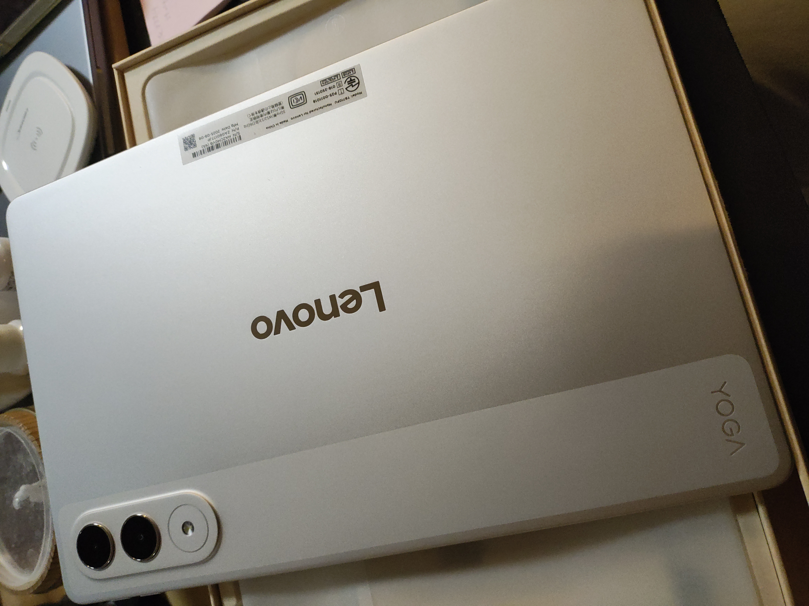

## 使用感

　OSはAndroid 15ですが、UIはカスタマイズされた「Lenovo ZUI」というものが採用されています。初回起動時に「17」という表示が出ますが、これはAndroidのバージョンではなくZUIのバージョンです。

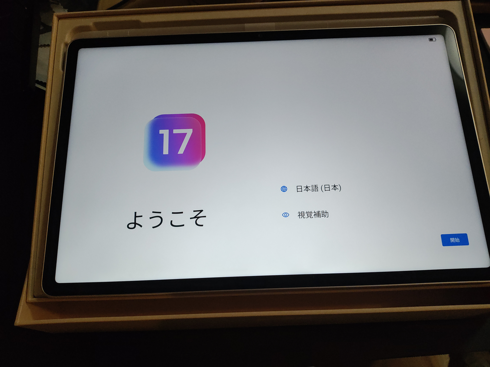

　Androidにおけるメーカー独自のUIカスタマイズについてはさまざまな意見があるかと思いますが、このZUIについてはホーム画面下にiPadOSのDockのようなもの（ランチャー）が設置されていたり、設定画面は2ペインデザインになっていたりと、かなりiPadOSを意識したようなものになっています。

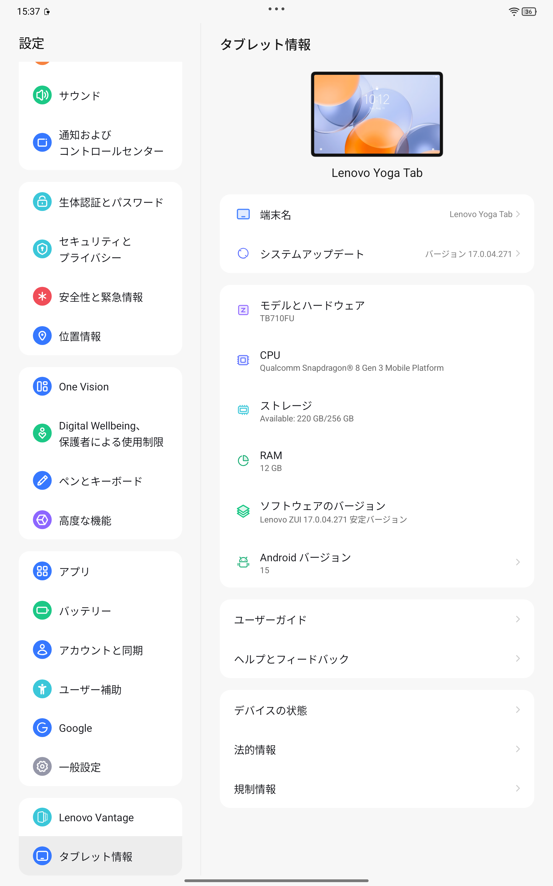

　マルチウィンドウや分割画面にも対応しており、画面上部に表示されている「…」をタップするとウィンドウを分割したりフローティングしたりするためのメニューが表示される点もiPadOSにそっくりです（iPadOS 26ではこのUIは廃止されてしまいましたが）。もちろんiPadOSとは設定項目やカスタマイズできる部分などが異なるため、iPadそのままの使い勝手というわけではないのですが、iPadからの乗換えでもほとんど違和感なく操作できるかと思います。

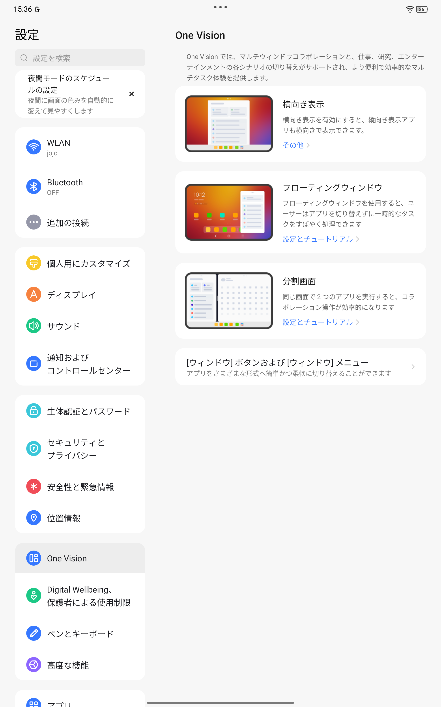

　それに加えて、画面端スワイプでの戻る操作といったAndroidのジェスチャーナビゲーションもそのまま使えるので、Androidスマホと併用している場合でも特に違和感なさそうです。UI操作へのレスポンスも良好で、操作感においてはiPadと比べても十分満足できるものでした。

　なお、デフォルトでは画面リフレッシュレート設定が「インテリジェント」になっており、状況に応じてリフレッシュレートを自動で調節するようになっています。ただ、この場合Webブラウザなどでの画面スクロール時にやや文字がブレるような感覚がありました。そのため、リフレッシュレート設定を「標準」（60Hz）もしくは「最大」（144Hz）に設定することをおすすめします。

　画面サイズに関しては、前述のように縦長になるように持った場合iPadよりもやや幅が狭くなります。WebやSNSの閲覧においてはほとんど困ることはないですが、横長になるように持った状態でWebマンガなどを見開きで閲覧する場合、Webブラウザのヘッダー領域の分だけページを表示する領域の高さが小さくなるため、全体としてページが小さめに表示されてしまいます。全画面表示にすればおおむね問題ないのですが、全画面表示をサポートしていないWebマンガサイトも一部存在するため、その点では若干不便です。こちらは強制的に全画面表示を可能にするブラウザ拡張機能等を利用することで解決できるかもしれません。

## アプリの対応

　Androidにおいてはタブレット専用のアプリというものはほぼ存在せず、基本的にはAndroidスマートフォン向けのアプリはすべて動作します。ただし、UIがタブレットに最適化されておらず、単に画面を大きく引き伸ばされただけのUIになってしまうものも多いです。Googleの提供しているアプリについては基本的にタブレット向けのUIを備えているため、使い勝手の面では困ることは基本的にありませんが、たとえばAndroid版のXアプリにはそのような気の利いた仕組みはなく、単純に画面脇に大きめの余白があるデザインでコンテンツが表示されます。

　なお、自分はメインのWebブラウザとしてFirefoxを使用しているのですが、Android版gのFirefoxはタブレット向けに最適化されたUIを備えており、タブレットでも快適に利用できます。拡張機能も利用可能ですし、基本設定で動画の自動再生をブロックすることも可能です。自分は個人的にWeb閲覧中に突然音が流れるのが大変ストレスで、そのためiPadでは基本的に音量を0にしておいて、必要な時だけ音量を上げ、コンテンツを見終わったらまた下げる、という作業を繰り返していたのですが、これが不要になるだけでもAndroidタブレットにした価値があると思っています。

## 生体認証の利用

　本機は指紋認証機能を搭載しておらず、生体認証は顔認証のみとなっています。ロック解除時などの顔認証のスピードは十分速く、精度としてもiPhoneのFaceIDと同程度のようです。ただ、カメラは長辺部、つまり横長になるように持ったときの上側に設置されているため、縦長になるように持った際には持ち方によっては指でカメラが覆われてしまうことがある点には注意が必要でした。

## タッチペンの利用

　自分は絵を描くわけではなく、ペンでのメモ等もほとんど使わないのでペンについては未知数です。ひとまず普通に使えることは確認しています。Apple Pencil Proのようなペン軸を押し込んで操作する（スクイーズ）機能はないようですが、ペンの軸をタップしたりスワイプしたりしての操作には対応しており、たとえばペンを握った状態で、人差し指で軸を撫でるような操作でコピー＆ペーストが行えます。この際に操作に応じてペンが振動し、コピーやペーストが行えたことが分かる仕組みになっています。

## 保護ケース

　AndroidデバイスはiPhoneやiPadと比べてケースや画面保護フィルムの選択肢が少ないという弱点があります。ただ、本機に関しては中国では「Xiaoxin Pad Pro GT 11.1」という名称で販売されており、このXiaoxin Pad Pro GT 11.1向けのケースや保護フィルムがそのまま利用できます。AliExpress等の中国系通販サイトで簡単に購入できますので、（そういったサイトが利用できれば）ケースや保護フィルムの入手性は高いです。最近は円安のため「激安」ではないものの、国内で流通しているiPad向けのケースとさほど変わらないか、少し安いくらいの価格で購入できます。たとえば自分が購入したこちらのケースは1,318円でした。

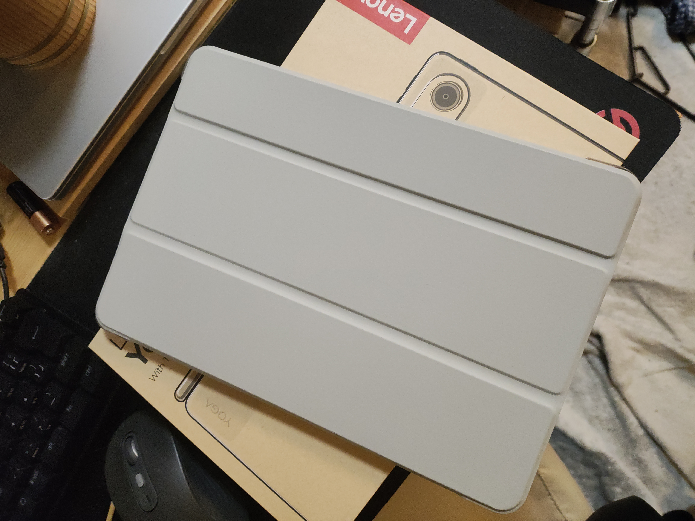
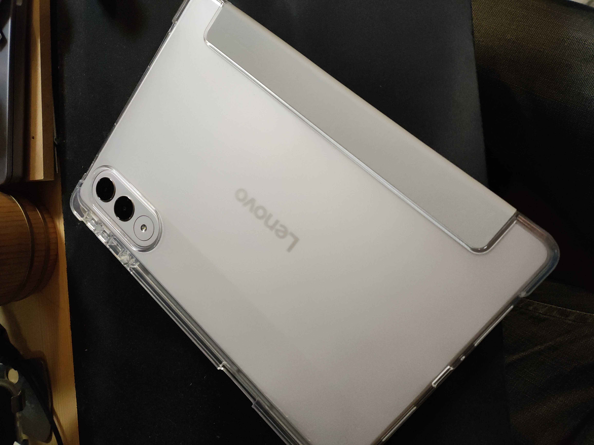

　ちなみにこちらのケース、ペンも一緒に収納できるのですが、その分幅が大きくなるのと、収納した状態ではペンが充電ができないという非常にアレな罠がありました……。それ以外はまったく問題なく、むしろスイッチ等も問題なく押せるような構造になっていてよくできている感じなので余計残念でした。

## コストパフォーマンス面での考察

　昨今では（円安がその大きな要因の1つかとは思いますが）Apple製品は販売価格の上昇が激しく、iPad miniですら現行モデルは7万8,800円から、iPad Airは9万8,800円からとだいぶお高くなっています。無印iPadは現在ではエントリーモデルという位置付けになっていることもあって5万8,800円からと購入しやすいお値段ではありますが、搭載するA16プロセッサは3年前（2022年9月）に発売されたiPhone 14 Proやその翌年に発売されたiPhone 15に搭載されていたものであり、それ以外のスペックについてもFaceIDやApple Intelligenceには非対応など、まさに「廉価版」というものになっています。

　一方のLenovo Yoga Tab （11.1インチ、2025）はiPad（128GBモデル）よりも5,000円ほど高い（6万3,800円）ですが、メモリやストレージはiPadの倍で、タッチペンも標準装備されています。プロセッサに関しても、Snapdragon 8 Gen 3は2年前にリリースされたものではありますが、単純な処理性能ではiPadのA16やiPan miniのA17 Proと比較してほぼ同等以上となっています（シングルスレッド性能はA17 Proよりも若干劣るがコア数が多いため総合性能としてはA17 Proよりも高い数値になる傾向が高い）。絶対的な性能でいうと当然iPad AirやiPad Proのほうが高いのですが、動画編集や重いグラフィック処理などを行わないのであれば本機でも十分ではないかと思います。

