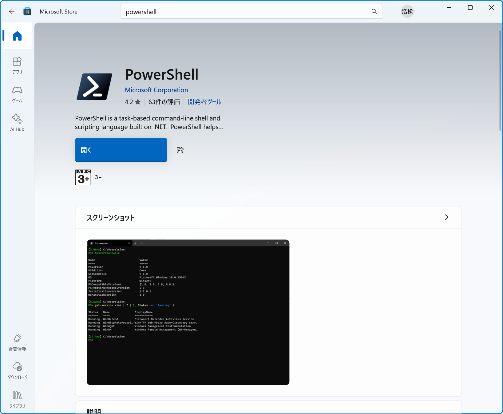

　思い立ったときにすぐに、開発用のディレクトリを作業ディレクトリにした状態でPowerShellを起動できると便利なのですが、それを実現する方法を調べたところマトモな結果が出てこなかったのでここでまとめておきます。

## 前提条件：Windows PowerShell 5.1とPowerShell 7は違う

　Windows 11にはWindows PowerShell 5.1が標準で提供されています。いっぽう、PowerShellの（本記事執筆時の）最新版はPowerShell 7系（手元の環境では7.5.4）です。そのため、最新版のPowerShellを利用したい場合、別途何らかの方法でPowerShellをインストールする必要があります（[MicrosoftのPowerShellインストールに関するドキュメント](https://learn.microsoft.com/ja-jp/powershell/scripting/install/installing-powershell-on-windows?view=powershell-7.5#installing-from-the-microsoft-store)）。

　自分はMicrosoft Storeからインストールを行ったのですが、ここで混乱を招くのが、PowerShell 7系をインストールしても、Windows 11で標準提供されているWindows PowerShell 5.1はそのまま残される点です。

## 色々なところで紹介されているPowerShellのショートカット作成方法は古い

　PowerShellのショートカットを作成する方法としてGoogle検索でよく見つかるのが、コントロールパネルの「Windowsツール」からショートカットを作成する、というものです。確かに、「Windowsツール」内のWindows PowerShellのコンテキストメニューには「ショートカットの作成」という項目があり、ここからショートカットを作成できます。しかし、このWindows PowerShell項目は、古いバージョン（Windowsで標準提供されているバージョン）のWindows PowerShell 5.1を起動する項目なのです。つまり、ここからショートカットを作っても、最新のPowerShell 7系は起動できません。

　PowerShell 7系のショートカットを作るには、まずPowerShell 7系の本体（つまり.exeファイル）がどこにあるのかを調べる必要があります。ここで面倒なのが、Microsoft Store経由でインストールされたソフトウェアはファイルシステム上隠蔽されており、そのファイルには直接アクセスできないという点です。

　たとえば、スタートメニューからPowerShellのコンテキストメニューを表示させても、そこには「ファイルの場所を開く」項目はありません。このコンテキストメニューからショートカットを作成することもできません。

　実は、Microsoft Store経由でダウンロードしたソフトウェアは、（システムドライブがC:の場合）通常は「C:\Program Files\WindowsApps」ディレクトリ以下にインストールされます。しかし、このディレクトリはエクスプローラーでは表示されず、またパスをエクスプローラーに入力して開こうとしても、デフォルトでは管理者権限を持っていてもアクセスできないよう制限がかかっています。単にショートカットを作成するためだけにこの設定を変更するのも微妙ですよね……。

## PowerShell 7系を起動するショートカットの作り方

　ということで試行錯誤して得られた手順は次のようになります。

　まず、Windowsターミナルを起動し、タイトルバーの何もない場所を右クリックしてコンテキストメニューを開いて「設定」をクリックします。

　するとWindowsターミナルの設定画面が表示されるので、ここで「プロファイル」項目内にある「PowerShell」をクリックします。そこに「コマンドライン」という項目があり、ここからPowerShellを起動するためのコマンドライン文字列を確認できます。この文字列を選択し、コピーしておきます。

　続いてエクスプローラーでショートカットを作成したいフォルダを開き、コンテキストメニューの「新規作成」－「ショートカット」を選択して「ショートカットの作成」ウィザードを開きます。「項目の場所を入力してください」というテキストボックスがあるので、そこで先ほどコピーしておいたPowerShellを起動するためのコマンドライン文字列をペーストします。あとは「次へ」をクリックしてウィザードを進めれば、ショートカットが作成されます。

　ショートカットが作成できたら、そのアイコンを右クリックし、「プロパティ」をクリックしてプロパティを開きます。ここで「ショートカット」タブ内に「作業フォルダー」という項目があるので、ここでPowerShell起動時に作業フォルダーに設定したいパスを指定し、「OK」をクリックすれば完了です。

## 「ターミナルで開く」で良いのでは？

　エクスプローラーのコンテキストメニューには「ターミナルで開く」という項目があり、これを選択することでそのディレクトリを作業ディレクトリにした状態で、Windowsターミナルで「既定のプロファイル」で選択したプロファイルを開くことができます。つまり、PowerShell 7系を「既定のプロファイル」に設定しておけば、今回のようにわざわざショートカットを作成せずとも、簡単にPowerShellを起動できます。ただ、既定のプロファイルを別のものにしている場合や、ショートカットを格納したディレクトリ以外を作業ディレクトリにして起動したい場合などには、今回紹介した内容が役立つのではないでしょうか。

